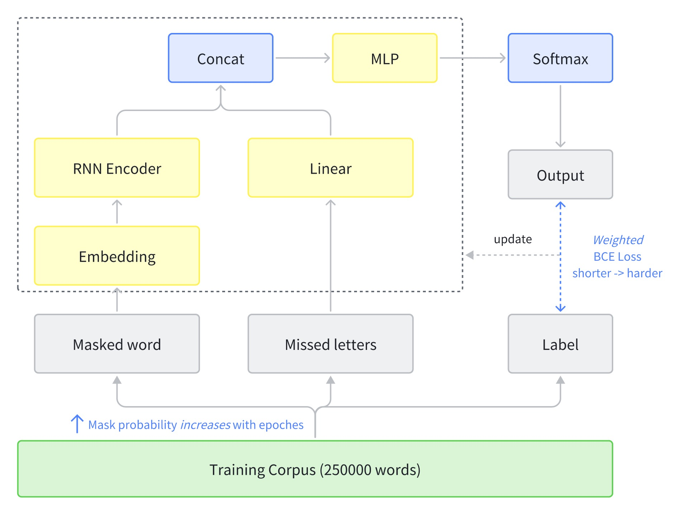
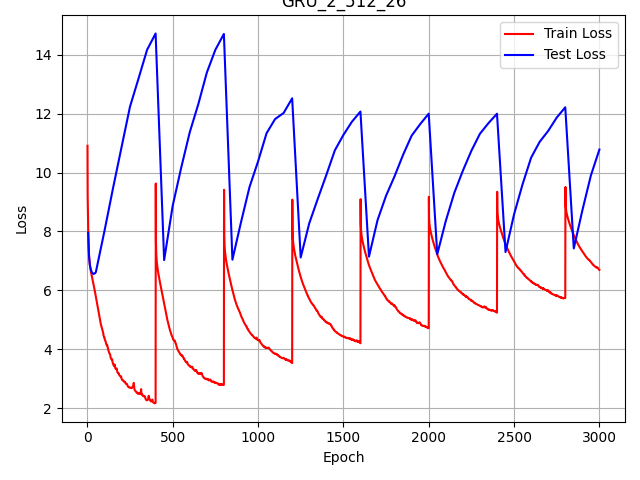
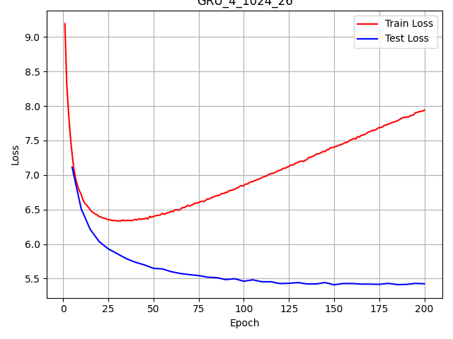

# Hangman Game Solvers

## TL;DR
> [!Important]
> *The overall success rate of 1000 online test words is **0.627***.

This report explores various strategies for solving the Hangman game, including rule-based, n-gram, and neural network approaches. The key findings are:
- N-gram models show significant improvements, with the best model (5-gram + 2/4 + 2/5) achieving a score of 66.16% in just 0.12 minutes.
- Among the neural network models, the GRU architecture outperforms LSTM and Transformer. Updating the masking probability per epoch boosts the GRU's performance to 69.36%.
- The best overall model is a combination of the GRU and n-gram models, achieving a score of 73.06%. The GRU captures long-range dependencies and semantic information, while the n-gram component provides useful statistical information about letter co-occurrences.

## Hangman game description
<!-- describe hangman game -->

Hangman is a classic word-guessing game that challenges players to deduce a hidden word by guessing one letter at a time. The game begins with the presentation of a series of blanks, each representing a letter of the secret word. Players take turns guessing letters they believe might be in the word. If a guessed letter is correct, it is revealed in its correct positions within the word. If the letter is not in the word, a part of a 'hangman' stick figure is drawn. The objective is to guess the word before the drawing of the hangman is completed, typically 6 incorrect guesses (head, body, 2 arms, 2 legs).

```
* [Game: ] start with a word: _ _ _ _ _
* [Player: ] guess a letter: a
* [Game: ] bingo! now: _ a _ _ _
* [Player: ] guess a letter: e
* [Game: ] sorry, no e in the word: _ a _ _ _
* [Player: ] guess a letter: l
* [Game: ] bingo! now: _ a l l _
* ...... until the word is guessed or the hangman is dead
```

## Preliminary Work

### Local Testing Setup

To enable faster testing and iterative development, I first rewrote the provided API code to create a local version of the Hangman game. To simulate the real test scenario, I obtained a comprehensive English word list from https://github.com/dwyl/english-words. I removed the training set words from this list to create a test set.

Running the baseline algorithm against this test set yielded an accuracy of around 20%, indicating that my constructed dataset has a similar distribution to the real test set and can be used as a validation set.


## Solutions

### Rule-based Strategy 

> The baseline algorithm will match the provided masked string (e.g. a _ _ l e) to all possible words (with the same length) in the dictionary, tabulate the frequency of letters appearing in these possible words, and then guess the letter with the highest frequency of appearence that has not already been guessed. If there are no remaining words that match then it will default back to the character frequency distribution of the entire dictionary.

Digging into the baseline method, I noticed that it only searches for words with exactly matching lengths when performing the search. This ignores many key prefix and suffix matches, such as "apple" to "appleberry".

I tried relaxing the search conditions to match against words of all lengths (`re.match` to `re.search`). This improved the accuracy from 20% to 38.0% (but the searching time also increases).

### N-gram Strategy
Now we try to convert the Hangman game into a mathematical probalistic problem.

First we define the objective as selecting a letter $c$ that is not in the set of already guessed letters $G_t$ and maximizes the probability of guessing the target word $w'$ given the current game state $w_t$. Mathematically, this can be represented as:

$$c_{t+1} = \arg\max_{c \notin G_t} P(w'|G_t, w_t, c)$$

To solve this problem, we can use Bayes' theorem to convert it into the problem of computing $P(G_t, w_t, c|w')$:

$$P(w'|G_t, w_t, c) = \frac{P(G_t, w_t, c|w')P(w')}{P(G_t, w_t, c)}$$

Here, $P(w')$ is the prior probability of the target word $w'$ occurring, which is usually assumed to be uniformly distributed; $P(G_t, w_t, c)$ is the marginal probability, which usually does not need to be computed directly.

The key is to compute $P(G_t, w_t, c|w')$, which can be further decomposed into $P(c|G_t, w_t, w')$ and $P(G_t, w_t|w')$. Among them, $P(c|G_t, w_t, w')$ represents the conditional probability that guessing the letter $c$ is correct given the target word $w'$, the current game state $w_t$, and the set of previously guessed letters $G_t$. This is the part that we approximate using the n-gram model.

The application of the n-gram model is as follows:

First of all, we need to construct a N-gram probability model based on the training set. 
``` python
def build_n_gram(word_list, max_n):
    # create n-gram from word list
    n_grams = {}
    for n in range(1, max_n + 1):
        n_grams[n] = collections.defaultdict(int)
        for word in word_list:
            for i in range(len(word) - n + 1):
                n_grams[n][word[i:i + n]] += 1
    return n_grams
```

Then, we can compute the probability of the letter $c$ appearing in the target word $w'$ based on the i-gram model:

- **1-gram**: Directly compute the probability of the letter $c$ appearing in the target word $w'$.
- **2-gram**: If certain substring of $w_t$ is in the form of [".x" or "x."]
- **3-gram**: If certain substring of $w_t$ is in the form of [".xx", "x.x", or "xx."]
- **4-gram**: If certain substring of $w_t$ is in the form of [".xxx", "x.xx", "xx.x", or "xxx."]
- **5-gram**: If certain substring of $w_t$ is in the form of [".xxxx", "x.xxx", "xx.xx", "xxx.x", or "xxxx."]

Furthermore, it also considers the situation that two letters are missing in the target substring, and the probability of the letter $c$ appearing in the corresponding position of the 4-gram and 5-gram.
- **2/4-gram**: If certain substring of $w_t$ is in the form of ["..xx", ".x.x", ".xx.", "x..x", "x.x.", "xx.."]
- **2/5-gram**: If certain substring of $w_t$ is in the form of ["..xxx", ".x.xx", ".xx.x", ".xxx.", "x..xx", "x.x.x", "x.xx.", "xx..x", "xx.x.", "xxx.."]

Next, compute the probability of the letter $c$ appearing in the corresponding position $P_i(c|w_t)$ based on the i-gram model. We use the number of occurrences of the n-gram as the probability estimate: 

> [!Note]
> Take the 2-gram as an example, the probability of the letter $a$ appearing in the target word `a..l` is calculated as follows:
> $$P_2(a|w_t) = \frac{count('aa') + count('al')}{\sum_\gamma count('a\gamma')+count('\gamma l
')}$$

By converting the counts of 1-gram to 5-gram into probability distributions and using preset weights $\alpha$ for weighted summation, we can obtain the final probability of each letter:

$$P(c|w_t) = \sum_{i=1}^{5} \alpha_i P_i(c|w_t)$$

where $P_i(c|w_t)$ is the probability estimate based on the i-gram, and $\alpha_i$ is the weight coefficient (In the experiment, we choose $\alpha$ as `[0.05, 0.1, 0.2, 0.3, 0.5]`).

Finally, we choose the letter $c$ that maximizes $P(w'|G_t, w_t, c)$ as the next guess.

### Neural Network Strategy

#### [NN.1] Words to Machine Learning Samples
To use deep learning methods for hangman game, it is necessary to convert the words into machine learning samples. The problem is modeled as a multi-class classification problem. The input is a word with a missing letter, and the output is the missing letter. The data is generated as follows:

- For each word, randomly mask letters with probability $p$ as binomial distribution
- Input: 0-26 encoding of the masked word & one-hot encoding of the misses letters
- Label: one-hot encoding of the missing letters

> [!Note]
> For example, for the word "apple" with the letter "p" missing, the input is "a _ _ l e" and the output is "p", and randomly pick some wrong letters as the missing letters ('s', 't').
> - Input: masked word [0, 26, 26, 11, 4]
> - Input: misses letters [18, 19]
> - Label: [0, 0, 0, 0, 0, 0, 0, 0, 0, 0, 0, 0, 0, 0, 0, 1, 0, 0, 0, 0, 0, 0, 0, 0] (one-hot encoding of 'p')

#### [NN.2] Model Architecture
For the neural network model, three different architectures were tested: GRU, LSTM, and Transformer model. The GRU model achieved the best performance, so I will focus on this model.



The output is a probability distribution over the 26 letters. The specific model structure is as follows:
1. Pass the masked word through an embedding layer to get the embedded vectors
2. Input the embedded vector into an encoder ( bidirectional GRU) to extract contextual information from the word
3. Output the hidden state of the last time step of the RNN
4. Project the miss_chars vector to a higher dimension through a linear layer
5. Concatenate the RNN output and the high-dimensional representation of miss_chars, then pass through a MLP (two Linear+ReLU layers), and finally output the probability distribution over the 26 letters

####  [NN.3] Training Strategy
For each training sample, we multiply the loss by a corresponding weight, meaning that the losses for shorter words (i.e. samples with smaller lengths) will be assigned higher weights. This is because shorter words are more difficult to guess, and we want to give the model more incentive to learn from them.

Besides, as the number of training rounds increases, gradually increase the probability $p$ to make training more difficult. 

``` python
drop_prob = 1/(1+np.exp(-self.cur_epoch/self.total_epochs))
num_to_drop = np.random.binomial(len(unique_pos), drop_prob)
```

Moerover, the experimental results show that we actually need to update the model parameters more frequently to achieve better performance (smoother convergence in the loss curves below).

|update after few epoches (from [repo](https://github.com/methi1999/hangman?tab=readme-ov-file))            |  update per epoch |
|:-------------------------:|:-------------------------:
|  |   |

### Boosting the GRU model with N-gram

The GRU model has a strong ability to capture the context of the word, but it may not be able to capture the statistical information of the word. Therefore, I tried to combine the GRU model with the n-gram model to improve the performance of the model.

The specific method is as follows:
1. Use the GRU model to predict the probability distribution of the next letter
2. Use the N-gram model to predict the probability distribution of the next letter
3. Combine the two probability distributions by taking sum of the two distributions
4. Choose the letter with the highest probability as the next guess

## Results and Discussion

The table below summarizes the local performance of various models on the Hangman game:

| Model |  Score (local) | time (min)| note|
|-------|--------------|--------|----|
|baseline| 21.04 | 1:30 |  |
|re.search| 38.16 | 3:00 | search all words |
|first order| 38.04 | 1:33 | inspired by [this blog](http://www.datagenetics.com/blog/april12012/index.html) |
|N-gram | 62.28 | 0:01 | inspired by [this repo](https://github.com/mattgalarneau/Hangman-NLP), with first order |
|N-gram + 2/4 | 64.32 | 0:07 | with first order |
|N-gram + 2/4 + 2/5  | 66.16 | 0:12 |with first order |
|N-gram + 2/4 + 2/5 + 3/5 | 65.90 | 2:18 |with first order, slow so drop 3/5 |
|GRU-4-1024 | 48.88 | 0:40 | train&test on single NVIDIA-3090 |
|GRU + interval-1| 69.36 | 0:40 | `interval-1` means update $p$ per epoch |
|LSTM | 67.36 | 0:40 | with interval-1 |
|Transformer | 40.12 | 0:40 | with interval-1 |
|***GRU + N-gram*** &#10004;| ***73.06*** | 0:43 | boosting the GRU model with N-gram |

The baseline model, which simply matches the masked word to dictionary words of the same length, achieves a score of 21.04%. Relaxing the search condition to match against words of all lengths (re.search) improves the score to 38.16%, at the cost of increased computation time.

The first-order model, which selects the most frequent letter based on the entire dictionary, performs similarly to re.search at 38.04%.

N-gram models show significant improvements, with scores increasing as higher-order n-grams are incorporated. The best n-gram model (N-gram + 2/4 + 2/5) achieves a score of 66.16% in just 0.12 minutes.

For the neural network models, the GRU architecture outperforms LSTM and Transformer. The GRU model can achieve accuracy close to the performance of the N-gram method. The advantage of the RNN model is that it can model longer-distance dependencies and capture more semantic information. Updating the masking probability $p$ per epoch (interval-1) further boosts the GRU's performance to 69.36%.

The best overall model is a combination of the GRU and n-gram models, achieving an impressive score of 73.06%. This suggests that the GRU is able to capture long-range dependencies and semantic information, while the n-gram component provides useful statistical information about letter co-occurrences.

In terms of computation time, the n-gram models are extremely fast, while the neural network models take longer to train and evaluate. However, the GRU + N-gram model strikes a good balance between accuracy and speed.


## Conclusion and Future Work

> [!Important]
> Overall, these results demonstrate the effectiveness of using both statistical language models (n-grams) and deep learning approaches (GRUs) for the Hangman game. The n-gram models provide a strong baseline by leveraging letter frequency and co-occurrence statistics, while the GRU is able to model more complex patterns and long-range dependencies. Combining these two approaches leads to the best performance.

Future work could explore more advanced neural architectures, such as Transformers with attention, as well as techniques for model compression and acceleration to further improve efficiency. Additionally, incorporating more sophisticated language models, such as those trained on larger corpora or using subword units, may help boost accuracy on rare or unseen words.

## Reproducibility

To reproduce the results, you can run the following commands:

```bash
# to train the GRU model, you need to create model, plots folders first, and have pytorch installed
python -m deeplearning.train 
```
Then you can play the hangman game with the trained model by `hangman_local.ipynb`.

## References

- codes:
  - https://github.com/mattgalarneau/Hangman-NLP
  - https://github.com/Jisheng-Liang/hangman_transformer
  - https://github.com/methi1999/hangman?tab=readme-ov-file
  - https://github.com/Azure/Hangman/blob/master/Train%20a%20Neural%20Network%20to%20Play%20Hangman.ipynb
- others:
  - https://stackoverflow.com/questions/9942861/optimal-algorithm-for-winning-hangman
  - https://blog.wolfram.com/2010/08/13/25-best-hangman-words/
  - http://www.datagenetics.com/blog/april12012/index.html
  - https://blog.csdn.net/weixin_42327556/article/details/103285869